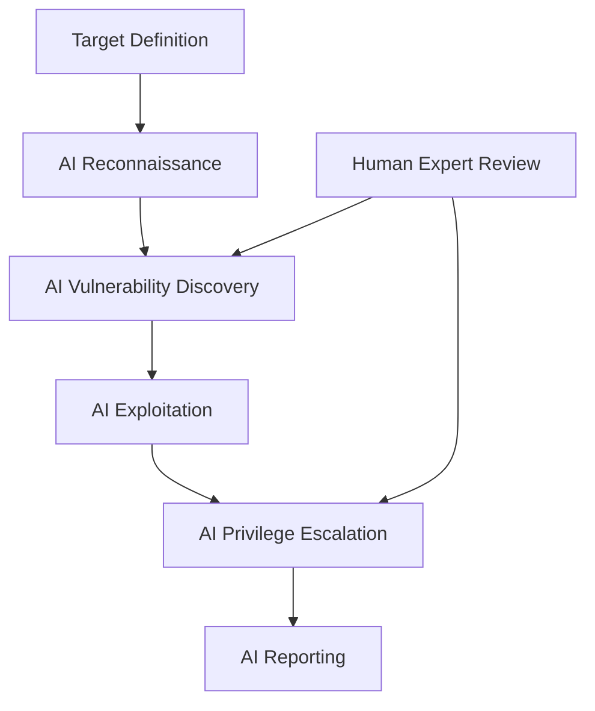

# AI-Powered Pentest Automation

The AI-Powered Pentest Automation system uses artificial intelligence to autonomously conduct penetration testing with human-level insight.

## Overview

Traditional penetration testing requires significant human effort. Our AI system automates the entire process from reconnaissance to reporting.

## How It Works

### Architecture



### Workflow

```
┌────────────────────────────────────────────────────────────────┐
│  AI Pentest Workflow                                          │
├────────────────────────────────────────────────────────────────┤
│                                                                │
│  1️⃣ SCOPE DEFINITION                                          │
│     └─ Define targets, rules of engagement, constraints       │
│                                                                │
│  2️⃣ AI RECONNAISSANCE                                         │
│     ├─ Passive information gathering                          │
│     ├─ Active footprinting                                    │
│     └─ Technology fingerprinting                              │
│                                                                │
│  3️⃣ AI VULNERABILITY DISCOVERY                               │
│     ├─ AI-powered scanning                                    │
│     ├─ Context-aware analysis                                  │
│     └─ False positive elimination                             │
│                                                                │
│  4️⃣ AI EXPLOITATION                                          │
│     ├─ Intelligent payload generation                          │
│     ├─ Chained attacks                                        │
│     └─ Proof-of-concept generation                           │
│                                                                │
│  5️⃣ AI PRIVILEGE ESCALATION                                  │
│     ├─ Lateral movement                                        │
│     └─ Post-exploitation                                      │
│                                                                │
│  6️⃣ REPORTING                                                │
│     ├─ Executive summary                                      │
│     ├─ Technical details                                      │
│     └─ Remediation roadmap                                     │
│                                                                │
│  7️⃣ HUMAN EXPERT REVIEW                                       │
│     └─ Expert validation of findings                          │
│                                                                │
└────────────────────────────────────────────────────────────────┘
```

---

## Features

### 1. Intelligent Reconnaissance

```python
from burp_kb.ai_pentest import Reconnaissance

recon = Reconnaissance(
    target="https://example.com",
    ai_model="recon-expert-v2"
)

# Run reconnaissance
results = recon.run()

# Results include:
# - Subdomain enumeration
# - Technology stack identification
# - Potential entry points
# - Attack surface mapping
```

### 2. AI Vulnerability Discovery

```python
from burp_kb.ai_pentest import VulnerabilityScanner

scanner = VulnerabilityScanner(
    target="https://api.example.com",
    scan_depth="deep",
    ai_enhanced=True
)

# AI discovers vulnerabilities
vulns = scanner.scan()

# Each vulnerability includes:
# - Severity (AI-confirmed)
# - Exploitability score
# - Proof of concept
# - Remediation priority
```

### 3. Automated Exploitation

```python
from burp_kb import ExploitationEngine

exploiter.ai_pentest = ExploitationEngine(
    target="https://vulnerable.example.com",
    dry_run=False  # Set True for safe testing
)

# Attempt exploitation
results = exploiter.exploit(vulnerability)

# Results:
# - Exploitation success/failure
# - Impact assessment
# - Screenshots
# - Evidence collection
```

### 4. Smart Reporting

```python
from burp_kb.ai_pentest import ReportGenerator

generator = ReportGenerator(
    pentest_id="pentest_abc123",
    format="pdf",
    template="executive"
)

# Generate comprehensive report
report = generator.generate()

# Report includes:
# - Executive summary (AI-written)
# - Technical findings with PoC
# - Risk matrix
# - Remediation roadmap
# - Appendix with raw data
```

---

## AI Capabilities

### Natural Language Understanding

The AI understands:

- Business context of applications
- User roles and permissions
- Data sensitivity
- Regulatory requirements

### Intelligent Decision Making

```python
# AI decides optimal attack paths
attack_paths = ai.analyze(
    findings=vulnerabilities,
    constraints={
        "time_limit": "8 hours",
        "stealth_level": "medium",
        "critical_only": False
    }
)

# Returns prioritized attack paths
for path in attack_paths:
    print(f"Path: {path.name}")
    print(f"Success probability: {path.probability}%")
    print(f"Time to exploit: {path.estimated_time}")
```

### Learning & Adaptation

- Learns from each engagement
- Adapts to target environment
- Improves over time

---

## Comparison

### Traditional vs AI Pentest

| Aspect | Traditional | AI-Powered |
|--------|-------------|------------|
| Duration | 1-4 weeks | 4-24 hours |
| Cost | $10K-100K | $2K-20K |
| Coverage | 60-80% | 85-95% |
| Consistency | Varies | Consistent |
| Availability | Schedule-dependent | On-demand |
| Reporting | 1-2 weeks | Immediate |

---

## Use Cases

### 1. Continuous Security Testing

```python
# Run AI pentest weekly
schedule = AICronSchedule(
    frequency="weekly",
    targets=["prod-api", "customer-portal", "internal-tools"]
)

schedule.start()
```

### 2. Pre-Release Security Check

```python
# Before production release
result = ai_pentest.run(
    target=staging_environment,
    scope=["api", "web", "mobile"],
    intensity="high"
)

if result.risk_score < 30:
    release_approved()
else:
    block_release()
```

### 3. Post-Deployment Validation

```python
# Validate security controls
result = ai_pentest.validate(
    target=production_environment,
    controls=["waf", "mfa", "encryption"]
)
```

---

## Pricing

| Plan | Price | Scans/year | Targets | Support |
|------|-------|------------|---------|---------|
| Starter | $499/mo | 12 | 3 | Email |
| Professional | $1,499/mo | 52 | 10 | Priority |
| Enterprise | Custom | Unlimited | Unlimited | Dedicated |

---

## Deliverables

### Report Contents

```
┌─────────────────────────────────────────────────────────────────┐
│  AI Pentest Report                                              │
├─────────────────────────────────────────────────────────────────┤
│                                                                  │
│  📋 EXECUTIVE SUMMARY                                          │
│     - Overall risk rating                                       │
│     - Key findings                                              │
│     - Business impact                                           │
│                                                                  │
│  🔍 METHODOLOGY                                                 │
│     - AI approach                                               │
│     - Tools used                                                │
│     - Coverage                                                  │
│                                                                  │
│  ⚠️ FINDINGS                                                    │
│     - Critical (with PoC)                                       │
│     - High                                                      │
│     - Medium                                                    │
│     - Low                                                       │
│     - Informational                                             │
│                                                                  │
│  🗺️ ATTACK PATHS                                               │
│     - Visual diagram                                            │
│     - Step-by-step breakdown                                    │
│                                                                  │
│  🛠️ REMEDIATION                                                 │
│     - Priority matrix                                           │
│     - Technical recommendations                                 │
│     - Quick wins                                                │
│                                                                  │
│  📎 APPENDIX                                                    │
│     - Raw scan data                                             │
│     - AI decision logs                                          │
│     - Screenshots                                               │
│                                                                  │
└─────────────────────────────────────────────────────────────────┘
```

---

## Human Expert Review

Every AI pentest includes **human expert review**:

| Level | Review Included |
|-------|----------------|
| Starter | 1 hour review |
| Professional | 4 hour review |
| Enterprise | Full team review |

---

## Security & Compliance

### Safe Testing

- **Stealth Mode**: Evade detection
- **Rate Limiting**: Avoid impacting targets
- **Safe Mode**: Non-destructive exploitation only
- **Breakglass**: Instant termination capability

### Compliance

- SOC 2 Type II
- ISO 27001
- GDPR Compliant
- Ethical Testing Only

---

## Getting Started

```python
# Quick start
from burp_kb.ai_pentest import AIPentest

pentest = AIPentest(
    target="https://example.com",
    scope=["api", "web"],
    intensity="standard"
)

# Run pentest
results = pentest.run()

# Get report
report = results.generate_report()
```

---

## FAQ

**Q: Is AI pentest better than human?**
A: AI excels at coverage and consistency. Humans excel at complex reasoning. Best results combine both.

**Q: What about zero-days?**
A: AI focuses on known patterns but can identify anomalies. Zero-day research requires human experts.

**Q: Can it break things?**
A: Safe mode prevents destructive actions. Production testing uses careful controls.

---

## Contact

- Email: aipentest@burpkb.com
- Demo: https://demo.burpkb.com/aipentest
- Docs: https://docs.burpkb.com/ai-pentest
